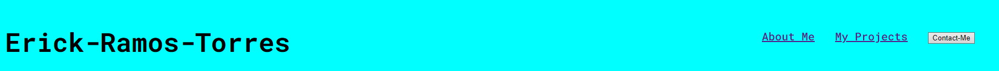
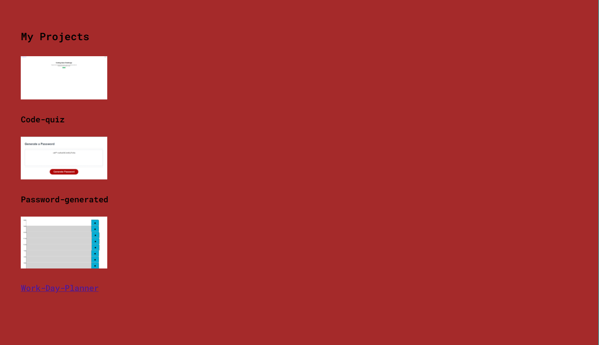
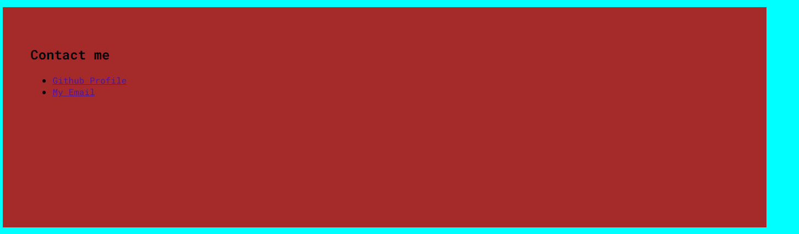
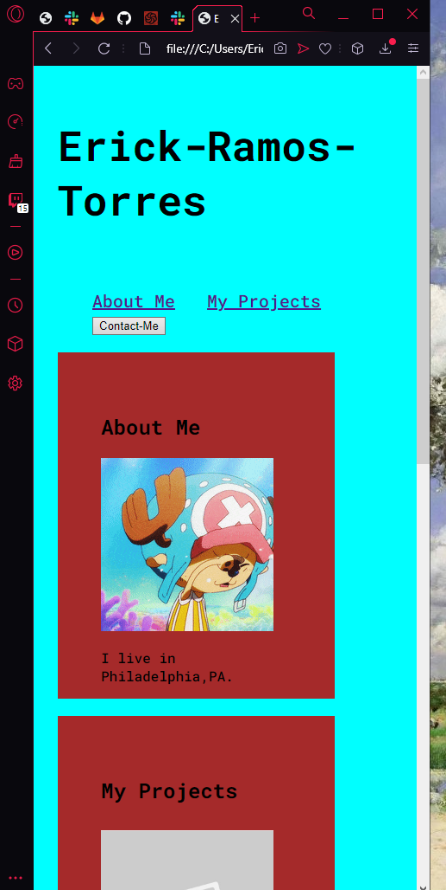

# myportfolio

## Objective

I want to display a starter base website for my portfolio. A Portfolio that can possible grab an employer or anybody attention to what I have to present. Including sections in website to captivate my audience such as an "About-Me", "My-Projects, and a "Contact me" section for further communication. 

## Screenshots
### Operating Header Tag

### Project Overview with clickable images to repos

### Contact Me Section 

### Pseudo Class with a hover affect 

### Media Query

### Link to deployed website
https://erickramostorres.netlify.app
